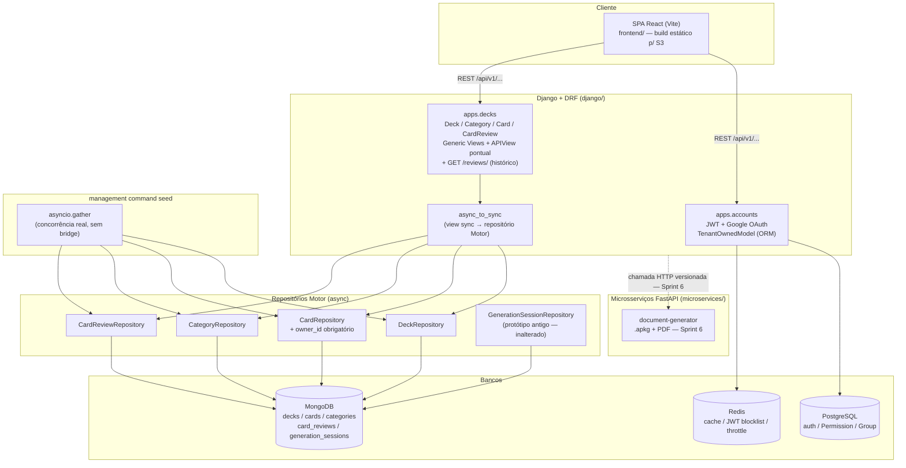

<div align="center">
    
</div>

# 🎴 Anki Generator

Plataforma de flashcards inspirada no Anki, com um agente de IA que dá feedback de estudo, sugere novos cards/decks, envia lembretes via WhatsApp e gera relatórios periódicos de desempenho em PDF.

> A partir da **Sprint 0**, a arquitetura mudou drasticamente em relação às versões anteriores deste README: o projeto passou de um monólito FastAPI/Flask incompleto para Django como backend principal + microsserviços FastAPI satélites. Veja o porquê e o histórico completo das decisões em [PROMPT_REFINADO.md](./PROMPT_REFINADO.md).

## 📖 Documentação de referência

Este README é só uma porta de entrada. As fontes de verdade do projeto são:

- **[PROMPT_REFINADO.md](./PROMPT_REFINADO.md)** — especificação técnica mandatória: regras de arquitetura, decisões já tomadas (`<decisoes_resolvidas>`) e ainda pendentes (`<decisoes_pendentes>`). Qualquer dúvida de "como isso deve ser implementado" começa aqui.
- **[PRD.md](./PRD.md)** — roadmap do produto em sprints (checklist), da fundação até a última feature.
- **[design_system/design-system.html](./design_system/design-system.html)** — fonte única de verdade visual (cores, tipografia, componentes) para todo o frontend.
- **`openspec/changes/`** — propostas de arquitetura em formato spec-driven (proposal/design/specs/tasks), usadas para planejar e executar mudanças estruturais como a da Sprint 0.

## 🏗️ Arquitetura



Estrutura de pastas: cada unidade implantável é uma pasta própria na raiz — `django/` (o backend principal), `microservices/<nome>/` (cada microsserviço FastAPI, um por pasta) e `frontend/` (SPA React, Sprint 3). `docker-compose.yml` e `Makefile` ficam na raiz e orquestram todas elas.

- **Backend principal**: Django + DRF, multi-tenant, URLs versionadas (`/api/v1/`).
- **Autenticação**: JWT (`simplejwt`) com refresh token revogável via blocklist no Redis + login Google OAuth (`django-allauth` + `dj-rest-auth`) — `django/apps/accounts/`. Multi-tenant = isolamento por usuário (`TenantOwnedModel`), sem entidade `Organization` separada.
- **Domínio de deck/card**: `django/apps/decks/` — entities (`Deck`/`Category`/`Card`/`CardReview`), value objects e repositórios Mongo (via Motor). Isolamento multi-tenant aqui é `owner_id` obrigatório embutido em toda query do repositório (mecanismo próprio, já que não há ORM do Django sobre Mongo). CRUD via Generic Views do DRF com serializers manuais; repetição espaçada via FSRS (pacote `fsrs`); views síncronas fazendo bridge (`async_to_sync`) para os repositórios assíncronos.
- **Frontend**: `frontend/` — SPA React (Vite), consumindo a API do Django. Tokens de design extraídos por auditoria real de `refs/Ashley_files/style.css` (ver `frontend/src/tokens/`), não importados diretamente — o `design_system/design-system.html` documenta um template comercial de portfólio, não um design system de app pronto. Home dashboard com gráfico (Chart.js) exportável em PDF (`jsPDF`); sem tela de login ainda (JWT obtido manualmente, ver `frontend/README.md`).
- **Microsserviço de documentos**: `microservices/document-generator/` — FastAPI, gera `.apkg` (genanki + gTTS) e relatórios PDF.
- **Mensageria**: RabbitMQ (broker do Celery) + Redis (result backend/cache).
- **Deploy real**: VPS (Docker Compose) — não AWS. O único uso de AWS é o bucket S3 do frontend estático.
- **Observabilidade**: logs estruturados → Prometheus/Grafana → node_exporter → exporter RabbitMQ/Celery (ordem de instrumentação já decidida, ver PROMPT_REFINADO.md).

## 🛠️ Stack

| Camada | Tecnologia |
|---|---|
| Backend principal | Django 6 + Django REST Framework, Python 3.13, Poetry |
| Autenticação | JWT (`djangorestframework-simplejwt`) + Google OAuth (`django-allauth` + `dj-rest-auth`) |
| Repetição espaçada | FSRS (pacote `fsrs`) |
| Testes | pytest + pytest-django |
| Microsserviços | FastAPI, `venv`/`requirements.txt` por serviço |
| Banco relacional | PostgreSQL (auth/permissions do Django) |
| Banco de domínio | MongoDB (decks/cards/categorias/reviews), via Motor |
| Fila/assíncrono | Celery + RabbitMQ + Redis |
| Frontend | React + Vite (SPA estática, hospedada em S3), `react-router`, Chart.js + `jsPDF` |
| Deploy | Docker Compose numa VPS |

## 🚀 Como rodar localmente

### Pré-requisitos
- Python 3.13 (via `pyenv`, já pinado em `.python-version`)
- Poetry
- Docker + Docker Compose

### Passo a passo

1. **Instale as dependências do Django**
   ```bash
   poetry -C django install
   ```

2. **Configure as variáveis de ambiente**
   ```bash
   cp django/config.example.env django/.env
   cp microservices/document-generator/config.example.env microservices/document-generator/.env
   ```
   Gere uma `DJANGO_SECRET_KEY` real e coloque no `django/.env`:
   ```bash
   poetry -C django run python -c "from django.core.management.utils import get_random_secret_key; print(get_random_secret_key())"
   ```
   Pra login com Google funcionar de ponta a ponta, preencha também `GOOGLE_OAUTH_CLIENT_ID`/`GOOGLE_OAUTH_CLIENT_SECRET` no `django/.env` com credenciais reais de um projeto OAuth no [Google Cloud Console](https://console.cloud.google.com/) — sem isso, o restante do backend funciona normalmente, só o endpoint `/api/v1/auth/google/` não completa o handshake.

3. **Suba a stack completa** (Django, Postgres, MongoDB, Redis, RabbitMQ, Celery worker, document-generator)
   ```bash
   make up
   ```
   Django fica em `http://localhost:8000`, o document-generator em `http://localhost:8001`.

4. **Rode as migrations** (o container `web` já roda `migrate` automaticamente no entrypoint; para rodar manualmente fora do container)
   ```bash
   make migrate
   ```

5. **Health checks**
   ```bash
   curl http://localhost:8000/api/v1/health/
   curl http://localhost:8001/document-generator/v1/health/
   ```

6. **Frontend** (opcional, Sprint 3+)
   ```bash
   make frontend-install
   make frontend-dev
   ```
   Abre em `http://localhost:5173`. Sem tela de login ainda — ver `frontend/README.md` para obter um JWT manualmente.

### Comandos úteis (`Makefile`)

| Comando | O que faz |
|---|---|
| `make up` / `make down` | Sobe/derruba a stack via Docker Compose |
| `make logs` | Segue os logs de todos os serviços |
| `make migrate` / `make makemigrations` | Migrations do Django |
| `make run` | Roda o Django fora de container (`runserver`) |
| `make frontend-install` / `make frontend-dev` / `make frontend-build` / `make frontend-lint` | SPA React (`frontend/`) |

## 🧪 Testes

```bash
# Suíte pytest completa — 28 testes: auth/multi-tenant/auditoria/rate limiting (Sprint 1)
# + isolamento multi-tenant Mongo/CRUD/revisão FSRS/seed (Sprint 2)
# Requer Postgres + Redis + MongoDB rodando (`make up`)
poetry -C django run pytest apps/accounts apps/decks

# Teste de integração MongoDB (script standalone, à parte do pytest — requer `make up` rodando, ao menos o serviço mongo)
poetry -C django run python -m apps.decks.tests.test_mongodb_integration

# Popular o banco com dados de desenvolvimento (múltiplos usuários/decks/categorias/cards/reviews)
poetry -C django run python manage.py seed_decks        # --reset para recriar do zero
```

## 🎯 Roadmap

Roadmap completo, em sprints, com checklist detalhado: **[PRD.md](./PRD.md)**.

- [x] Sprint 0 — Fundação de arquitetura (Django + domínio consolidado + Docker Compose + microsserviço de documentos)
- [x] Sprint 1 — Autenticação & multi-tenant
- [x] Sprint 2 — Decks & Cards (domínio core)
- [x] Sprint 3 — Frontend base & home dashboard (login Google + e-mail/senha, refresh de token adicionados ao escopo)
- [ ] Sprint 4 — Estatísticas por deck (endpoint dedicado + dropdown na Home) — inserida fora da ordem original
- [ ] Sprint 5 — Testes & CI/CD (backend + frontend, GitHub Actions) — inserida fora da ordem original
- [ ] Sprint 6 — Exportação Anki & microsserviço de documentos (integração completa)
- [ ] Sprint 7 — Agente de IA (LangChain/LangGraph)
- [ ] Sprint 8 — Notificações WhatsApp (Evolution API)
- [ ] Sprint 9 — Relatório semanal por e-mail
- [ ] Sprint 10 — Deploy real (VPS + S3 + domínio)
- [ ] Sprint 11 — Observabilidade
- [ ] Sprint 12 — Hardening & revisão final

## 🤝 Contribuindo

Este é um projeto de portfólio/estudo. Sinta-se à vontade para sugerir melhorias ou reportar issues.

## 📝 Licença

Este projeto é de uso pessoal/educacional.

## 👤 Autor

**Willames Campos**
- Email: willwjccampos@gmail.com

---

**Desenvolvido com foco em arquitetura orientada a eventos, multi-tenant e aprendizado guiado de cloud/DevOps.**
