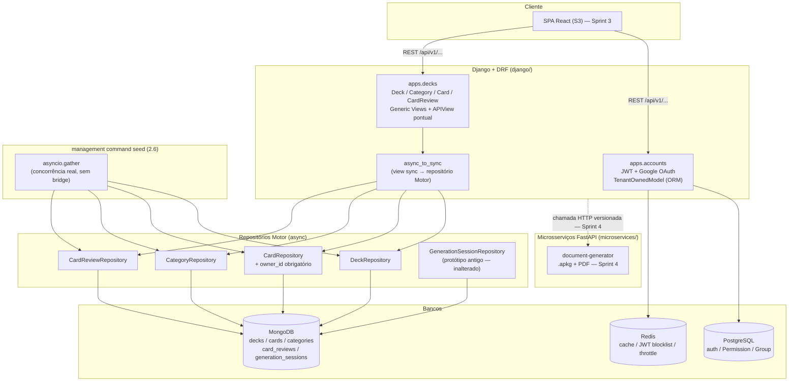

## Context

O domínio de deck/card foi migrado na Sprint 0 a partir de um protótipo anterior (gerador de vocabulário via IA) e ainda reflete esse propósito antigo: `Card`/`Deck` (dataclasses, persistidos em MongoDB via Motor, `django/apps/decks/domain/` + `infrastructure/`) não têm campo de dono, não têm `Category` (a entidade não existe), e não têm nenhum campo de agendamento de repetição espaçada. A Sprint 1 resolveu multi-tenancy e auditoria, mas via `TenantOwnedModel`/`AuditMixin` — mixins de model Django ORM sobre PostgreSQL. Esse mecanismo não cobre Mongo: nenhum model Django existe para deck/card, e não vai existir (a decisão de manter decks/cards em Mongo, tomada na Sprint 0, não muda aqui).

Esta sprint parte de uma sessão de mentoria via `backend-mentor` que resolveu 5 pontos técnicos antes desta formalização: isolamento multi-tenant em Mongo, Generic Views do DRF sobre repositório assíncrono, sync vs. async nas views, escolha do algoritmo de repetição espaçada, e a colisão de nome entre `GenerationSession` (job de geração via IA) e o novo conceito de evento de revisão.

## Goals / Non-Goals

**Goals:**
- Isolamento multi-tenant em Mongo — equivalente em rigor ao `<ponto_critico id="isolamento-multi-tenant">` da Sprint 1, mas implementado na camada de repositório Motor (sem ORM).
- CRUD REST versionado para `Deck`, `Category` e `Card`, usando Generic Views do DRF sempre que o padrão encaixar; `APIView` só onde o recurso não é CRUD (registro de revisão).
- Agendamento de repetição espaçada via FSRS, com campos novos no `Card`.
- Registro de evento de revisão (`CardReview`) por card, base para estatísticas futuras (Sprint 3).
- Índices Mongo obrigatórios: `owner_id`, `deck_id`, `category_id`/`tags`.
- Serializers magros e herdáveis (sem duplicar lógica de repositório/validação entre `Deck`/`Category`/`Card`).
- Management command de seed multi-tenant, idempotente/`--reset`, protegido contra produção, usando concorrência real via `asyncio.gather` (não bridge — script standalone, sem ciclo request/response).
- Diagrama Mermaid da arquitetura atual do projeto (abaixo).

**Non-Goals:**
- Views assíncronas nativas (`adrf`) — views seguem síncronas com `async_to_sync` envolvendo as chamadas ao repositório Motor (ver D3). Revisitar apenas se surgir gargalo real medido.
- Decks/cards compartilhados entre usuários, ou qualquer hierarquia tipo professor/aluno — fora do escopo do produto hoje (mesma razão da Sprint 1, D3: YAGNI).
- Frontend consumindo esses endpoints (Sprint 3) e estatísticas agregadas na home (também Sprint 3) — esta sprint só produz o dado, não a visualização.
- Otimização fina dos parâmetros do FSRS (ex.: fitting por usuário) — usa-se a configuração padrão do pacote `fsrs`; tuning fica para uma iteração futura se a qualidade do agendamento se mostrar insatisfatória em uso real.

## Decisions

### D1 — Isolamento multi-tenant em Mongo: `owner_id` obrigatório na assinatura do repositório, nunca opcional
Sem `QuerySet`/`Manager` do Django ORM disponível, a disciplina de "todo filtro de tenant embutido na query, nunca conferido depois em Python" precisa vir de outro lugar: da própria assinatura dos métodos do repositório. `Deck` e `Card` ganham `owner_id: str` como campo direto (não só `Card.deck_id` transitivo) — toda leitura/escrita filtra por `owner_id` na query Mongo (`{"_id": ..., "owner_id": owner_id}`), nunca busca por ID e confere dono depois. Um teste equivalente a `test_cross_tenant_access_by_id_is_blocked` (Sprint 1) é escrito contra os repositórios Mongo reais.
- **Alternativa considerada**: uma classe base de repositório genérica imitando `TenantOwnedManager`. Rejeitada — Motor não tem o mecanismo de composição de query que o ORM oferece; forçar essa abstração seria fingir uma equivalência que não existe. Um mixin fino que só valida a assinatura (exige `owner_id`) é honesto sobre a diferença de tecnologia.
- **Alternativa considerada**: buscar por ID e checar `owner_id` depois em Python. Rejeitada — é exatamente o anti-padrão que `security.md` cataloga como causa mais comum de IDOR (checagem de autorização depois de já ter localizado o recurso).

### D2 — Generic Views do DRF com `serializers.Serializer` manual + `get_queryset()` retornando lista já resolvida
`ModelSerializer` não se aplica (exige um `Model` Django real). Os serializers de `Deck`/`Category`/`Card` são `serializers.Serializer` com `create()`/`update()` escritos à mão delegando ao repositório — o mesmo padrão já usado no `AuditSerializerMixin` da Sprint 1. A paginação do DRF só precisa de algo fatiável/contável (`len()` + `[a:b]`), então `get_queryset()` pode devolver uma lista Python já buscada do Mongo, sem precisar de um `QuerySet` de verdade — os Generic Views (`ListCreateAPIView`, `RetrieveUpdateDestroyAPIView`) funcionam normalmente em cima disso. Onde o recurso não é CRUD (ex.: `POST /cards/{id}/review/`, que dispara o cálculo de agendamento FSRS e grava um `CardReview` — uma ação de domínio, não uma substituição de estado), usa-se `APIView` puro.
- **Alternativa considerada**: abandonar Generic Views inteiramente, só `APIView`. Rejeitada — mais boilerplate repetido entre `Deck`/`Category`/`Card` sem necessidade, já que o ajuste acima preserva a regra mandatória do projeto sem forçar nada.

### D3 — Views síncronas + `async_to_sync`, sem adoção de views assíncronas nativas
DRF não tem suporte maduro a `async def` em `APIView.dispatch()` (a implementação do DRF sobrescreve o dispatch do Django com lógica própria — permissions/throttling/content negotiation — escrita antes de async ser levado a sério, e chamar um handler `async def` sem `await` só devolve um objeto coroutine não executado). Views seguem `def` normal, chamando os repositórios Motor via `asgiref.sync.async_to_sync`. A meta de escala do projeto (10k usuários ativos, requests esporádicos, não conexões persistentes/alta concorrência simultânea — decidido na Sprint 0) não justifica o ganho de um worker atender múltiplas requisições concorrentes esperando I/O — que é o único cenário em que async nativo compensaria.
- **Alternativa considerada**: `adrf` (Async DRF) + views nativamente assíncronas. Rejeitada por ora — dependência de comunidade menor, throttle/permission/pagination do DRF ainda sync-first, e nenhum gargalo real medido que justifique o ganho. Revisitar se/quando a meta de escala mudar de verdade.
- O repositório em si continua em Motor (não `pymongo`) mesmo com a view fazendo bridge — ver D3.1 abaixo.

### D3.1 — Repositório continua em Motor (async), não migra para `pymongo`
Mesmo a view fazendo bridge pra sync, o repositório permanece assíncrono porque **já existe um segundo consumidor real e concreto** nesta mesma sprint que se beneficia de concorrência de verdade: o management command de seed (D6) roda fora do ciclo request/response do Django e pode usar `asyncio.gather` para inserções concorrentes, sem bridge nenhuma. Motor é uma camada fina sobre o mesmo driver C do `pymongo` — não há pedágio de complexidade operacional por mantê-lo. Regra geral: constrói-se a camada de infra compartilhada para o consumidor mais exigente (o seed, aqui); os consumidores mais simples (a view Django) se adaptam via bridge, que é barata (uma chamada de função). O inverso — fazer um driver síncrono se comportar com concorrência real dentro de uma thread — não é possível sem trocar de driver ou pagar o custo de threads/multiprocessing.
- **Alternativa considerada**: migrar os repositórios para `pymongo` já que a view de hoje é sync. Rejeitada — descartaria código já validado na Sprint 0 sem ganho funcional, e tiraria o ganho real de concorrência que o seed command tem hoje.

### D4 — Repetição espaçada: FSRS via pacote `fsrs`
Entre SM-2 (clássico, ~50 linhas de fórmula bem conhecida) e FSRS (o que o Anki real usa desde 2023, modelo de decaimento de memória com mais parâmetros), a escolha recai sobre FSRS via o pacote Python `fsrs` — biblioteca mantida que encapsula a complexidade do algoritmo, então não é "a opção mais sofisticada só por sofisticação": usar a lib é *menos* código próprio pra manter que implementar SM-2 na mão, com resultado empiricamente melhor (menos revisões pra mesma retenção) e paridade com o Anki real (relevante pro projeto, que segue o modelo conceitual do Anki).
- **Alternativa considerada**: SM-2 implementado manualmente. Não descartada por ser pior tecnicamente, mas por não ser necessária como exercício de aprendizado nesta sprint — o objetivo aqui é ter repetição espaçada funcionando bem, não aprender a matemática do algoritmo do zero.
- `Card` ganha os campos de agendamento do FSRS (`stability`, `difficulty`, `due_at`, `state`, conforme o modelo do pacote `fsrs`).

### D5 — `CardReview`: entidade nova, evento por revisão — não reaproveita `GenerationSession`
`GenerationSession` continua representando um job de geração de cards via IA (protótipo antigo) — não mexe. O conceito da tarefa 2.3 (registro de acerto/erro por revisão) ganha entidade própria, `CardReview`, na granularidade de **um evento por revisão de card** (não uma "sessão" agregada) — a mesma granularidade que o Anki real usa internamente (tabela `revlog`: uma linha por revisão). "Sessão de estudo" (se necessário no futuro) vira uma visão agregada sobre esses eventos por período, não uma entidade própria armazenada.
- **Alternativa considerada**: renomear/expandir `GenerationSession` para cobrir os dois conceitos. Rejeitada — são conceitos de domínio genuinamente diferentes (job de geração via IA vs. evento de revisão de estudo); forçar os dois num nome só criaria confusão permanente no código.

### D6 — `Category`: entidade nova, mesmo padrão de `Deck`/`Card`
`Category` não existe no domínio migrado. É criada do zero seguindo exatamente o mesmo padrão (dataclass + repositório Motor + `owner_id` obrigatório desde o primeiro commit, não retrofitado depois). `Deck` ganha `category_id: Optional[uuid.UUID]`; `Card` ganha `tags: List[str] = field(default_factory=list)` — cobrindo o requisito de índice "categoria/tag" do PRD (tarefa 2.4) sem introduzir uma segunda forma de categorização paralela.

## Diagrama de arquitetura (atualizado — Sprint 2)

## Risks / Trade-offs

- **[Risco]** Isolamento multi-tenant mal implementado em Mongo é tão crítico quanto o da Sprint 1, mas sem a rede de segurança do ORM (sem `Manager` forçando o filtro). → **Mitigação**: `owner_id` obrigatório na assinatura de todo método do repositório (nunca parâmetro opcional), teste explícito de acesso cross-tenant contra o Mongo real (tarefa equivalente à 1.9).
- **[Risco, confirmado em implementação]** `AsyncIOMotorClient` fica preso ao event loop ativo no momento em que é criado. `asgiref.sync.async_to_sync`, sem um loop "principal" já rodando na thread (o caso de toda view DRF síncrona), cria um event loop **novo a cada chamada** (`asyncio.run` por baixo — não reaproveita loop entre chamadas, mesmo dentro da mesma request). O singleton `MongoDBConnectionManager` original quebrava com `RuntimeError: Event loop is closed` já na segunda chamada bridged do processo — e cada `Repository` também cacheava sua própria `_collection` por instância, quebrando mesmo depois do primeiro fix, sempre que uma instância era reusada em duas chamadas bridged separadas (ex.: `CardReviewView`, que faz `find_by_id` e depois `update` no mesmo `card_repo`). → **Mitigação (aplicada e validada via requests HTTP reais, não só testes unitários)**: `MongoDBConnectionManager.is_connected()` agora compara o loop atual (`asyncio.get_running_loop()`) com o loop em que o client foi criado, forçando reconexão quando divergem; todos os repositórios pararam de cachear `_collection` na instância, sempre resolvendo via `ensure_mongodb_connection()` (barato quando o loop não mudou). **Trade-off aceito**: cada chamada bridged reconecta ao Mongo se o loop mudou desde a última — em uso real (workers WSGI com múltiplas threads/processos) isso tende a acontecer com frequência, custando uma reconexão TCP extra por chamada. Aceitável na meta de escala atual (10k usuários ativos, requests esporádicos); se isso virar gargalo medido, a alternativa é uma thread dedicada com loop persistente recebendo trabalho via `run_coroutine_threadsafe` — deliberadamente não implementada agora, por ser complexidade sem problema medido ainda.
- **[Trade-off]** FSRS via biblioteca externa é uma caixa-preta em termos de fórmula — menos controle fino que uma implementação manual. → **Aceito**: o ganho (qualidade de agendamento, manutenção, paridade com Anki real) supera o controle perdido; parâmetros default do pacote são o ponto de partida.
- **[Risco]** Seed command mal protegido rodando em produção pode poluir dados reais. → **Mitigação**: checagem explícita de ambiente (`APP_ENV`/`DEBUG`) antes de qualquer escrita, testada explicitamente (tarefa 2.7).

## Migration Plan

1. Criar entidade `Category` (domain + repositório Motor + índice por `owner_id`).
2. Adicionar `owner_id` a `Deck` e `Card`; adicionar `category_id` a `Deck` e `tags` a `Card`.
3. Adicionar campos de agendamento FSRS ao `Card`; adicionar dependência `fsrs` ao Poetry.
4. Criar entidade `CardReview` + repositório.
5. Criar índices Mongo (`owner_id`, `deck_id`, `category_id`/`tags`) em todas as coleções afetadas.
6. Implementar serializers (`serializers.Serializer` manuais) e Generic Views para `Deck`/`Category`/`Card`; `APIView` para o endpoint de revisão.
7. Implementar `urls.py` do app `decks`, versionado (`/api/v1/...`), registrado em `core/urls.py`.
8. Implementar management command de seed (`asyncio.gather`, proteção contra produção, `--reset`).
9. Escrever testes (ao final, seguindo a convenção já registrada): isolamento cross-tenant em Mongo, CRUD dos endpoints, cálculo de agendamento FSRS, proteção do seed contra produção.
- **Rollback**: sem dados reais em produção ainda (mesma situação da Sprint 1) — rollback é `git revert`/descartar a branch, sem risco de perda de dados.

## Open Questions

- Nome exato do endpoint de ação de revisão (`POST /api/v1/cards/{id}/review/` é a proposta inicial) — confirmar durante a implementação.
- Se `tags` em `Card` deve ter alguma normalização/validação (lowercase, limite de tags por card) — decidir durante a implementação dos serializers, não bloqueia o design.
